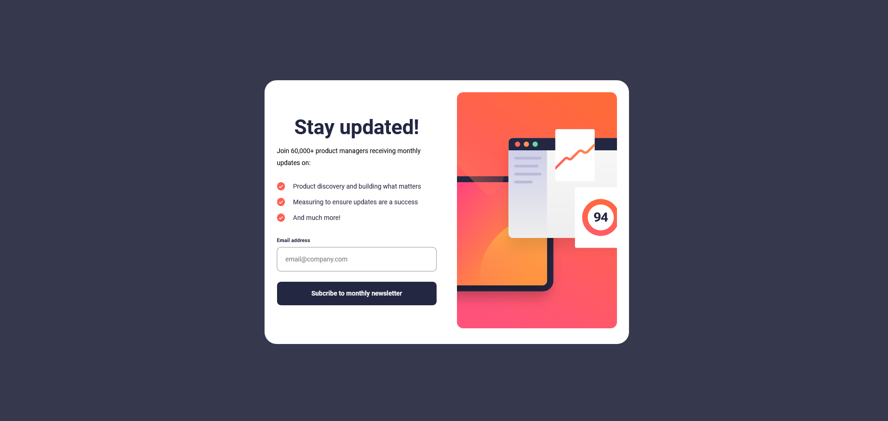
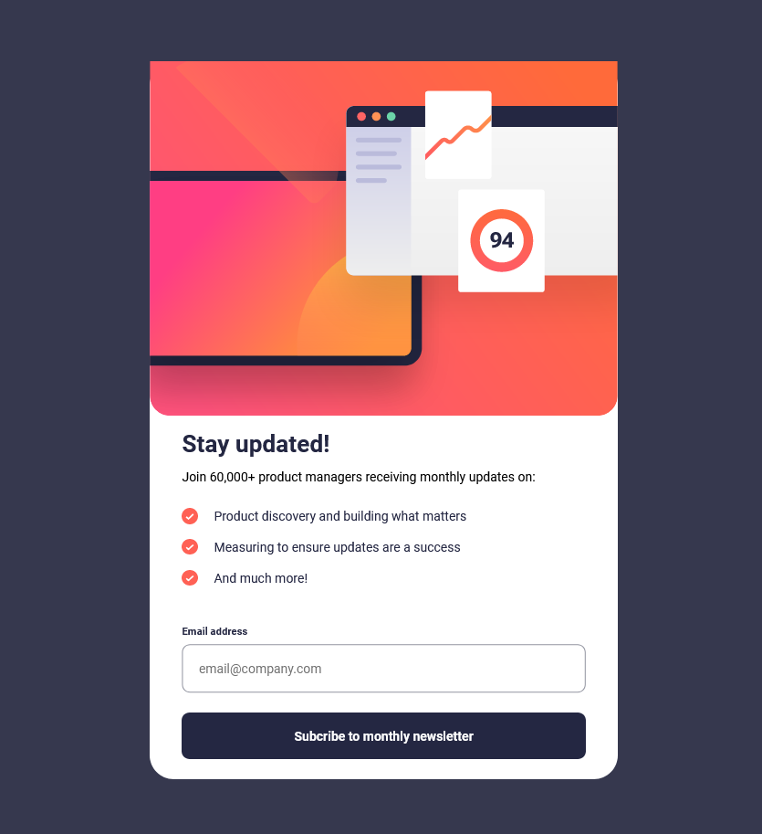
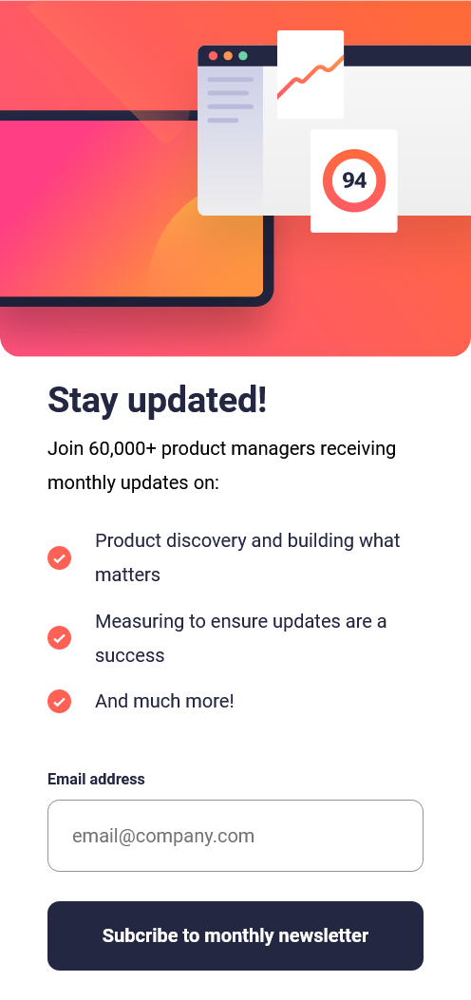

# Frontend Mentor - Formulario de suscripción al boletín con solución de mensaje de éxito

## Tabla de contenido

- [Frontend Mentor - Formulario de suscripción al boletín con solución de mensaje de éxito](#frontend-mentor---formulario-de-suscripción-al-boletín-con-solución-de-mensaje-de-éxito)
  - [Tabla de contenido](#tabla-de-contenido)
  - [Descripción general](#descripción-general)
    - [El reto](#el-reto)
    - [Captura de pantalla](#captura-de-pantalla)
      - [Desktop](#desktop)
      - [Tablet](#tablet)
      - [Mobil](#mobil)
    - [Enlaces](#enlaces)
  - [Mi proceso](#mi-proceso)
    - [Construido con](#construido-con)
  - [Autor](#autor)

## Descripción general

### El reto

Los usuarios deben ser capaces de:

- Agregue su correo electrónico y envíe el formulario
- Ver un mensaje de éxito con su correo electrónico después de enviar correctamente el formulario
- Ver mensajes de validación de formulario si:
   - El campo se deja vacío
   - La dirección de correo electrónico no tiene el formato correcto
- Ver el diseño óptimo para la interfaz según el tamaño de pantalla de su dispositivo
- Vea los estados de desplazamiento y enfoque para todos los elementos interactivos en la página

### Captura de pantalla

#### Desktop

#### Tablet

#### Mobil

### Enlaces

- URL de la solución: [Github](https://your-solution-url.com)
- URL del sitio en vivo: [Netlify](https://your-live-site-url.com)

## Mi proceso

### Construido con

- Marcado HTML5 semántico
- Propiedades personalizadas de CSS
- SASS
- GULP
- Flujo de trabajo Desktop primero
- JS

## Autor

- Mentor de frontend - [@jean266](https://www.frontendmentor.io/profile/jean266)
